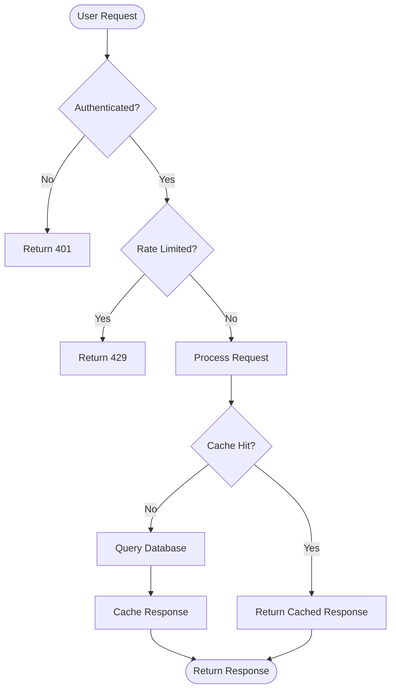
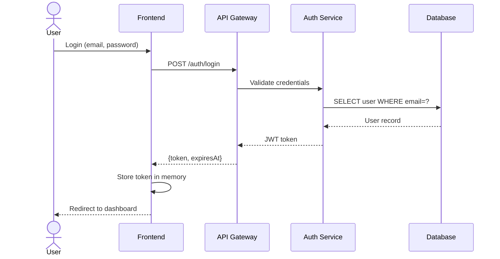
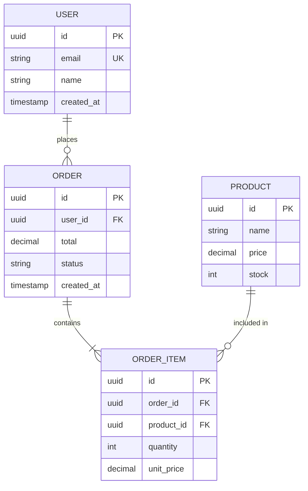
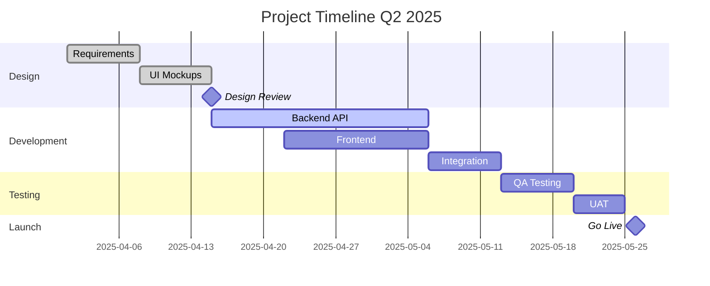
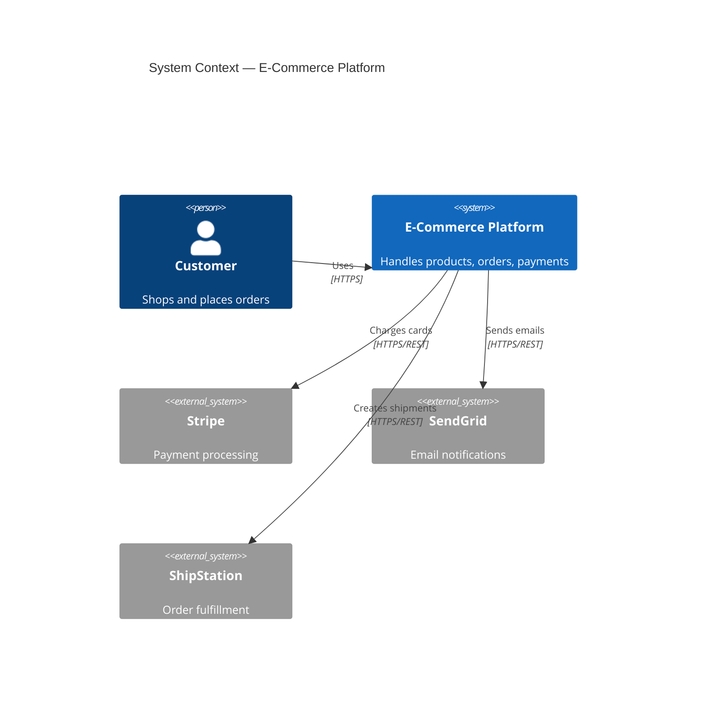

# Visual Content Skill

Automated diagram and visualization generation: Mermaid, PlantUML, architecture diagrams, data charts, network diagrams, and org charts — all in text-based, version-controllable formats.

## When to Activate

Activates automatically when you mention: Mermaid, diagram, flowchart, sequence diagram, ER diagram, class diagram, Gantt chart, PlantUML, architecture diagram, mind map, network diagram, org chart, Chart.js, Plotly, visualization, infographic, presentation.

## Covered Skills (25 total)

| Skill | What it does |
|-------|-------------|
| `mermaid-flowchart-creator` | Process and decision flowcharts |
| `mermaid-sequence-diagram` | Service interaction sequence diagrams |
| `mermaid-er-diagram` | Entity-relationship database diagrams |
| `mermaid-class-diagram` | UML class diagrams with relationships |
| `mermaid-state-diagram` | State machine diagrams |
| `mermaid-gantt-creator` | Project timeline Gantt charts |
| `plantuml-diagram-creator` | PlantUML component and deployment diagrams |
| `architecture-diagram-creator` | C4 model system architecture diagrams |
| `api-flow-diagram-creator` | API request/response flow diagrams |
| `network-diagram-generator` | Network topology diagrams |
| `org-chart-creator` | Organizational hierarchy charts |
| `mindmap-generator` | Topic mind maps |
| `user-journey-mapper` | User journey flow diagrams |
| `process-flow-generator` | Business process flow diagrams |
| `database-schema-visualizer` | Database schema as ER diagram |
| `chartjs-config-generator` | Chart.js configuration for web dashboards |
| `plotly-chart-creator` | Interactive Plotly charts |
| `data-visualization-helper` | Choose and configure the right chart type |
| `svg-icon-generator` | Simple SVG icon code |
| `technical-diagram-analyzer` | Analyze and improve existing diagrams |
| `infographic-outline-creator` | Infographic structure and content plan |
| `presentation-slide-outliner` | Slide deck structure and talking points |

## Mermaid Flowchart

## Mermaid Sequence Diagram

## Mermaid ER Diagram

## Mermaid Gantt

## C4 Architecture (Mermaid)

## Links

- [Repository](https://github.com/jeremylongshore/claude-code-plugins-plus-skills)
- Category: `18-visual-content` (25 skills)
